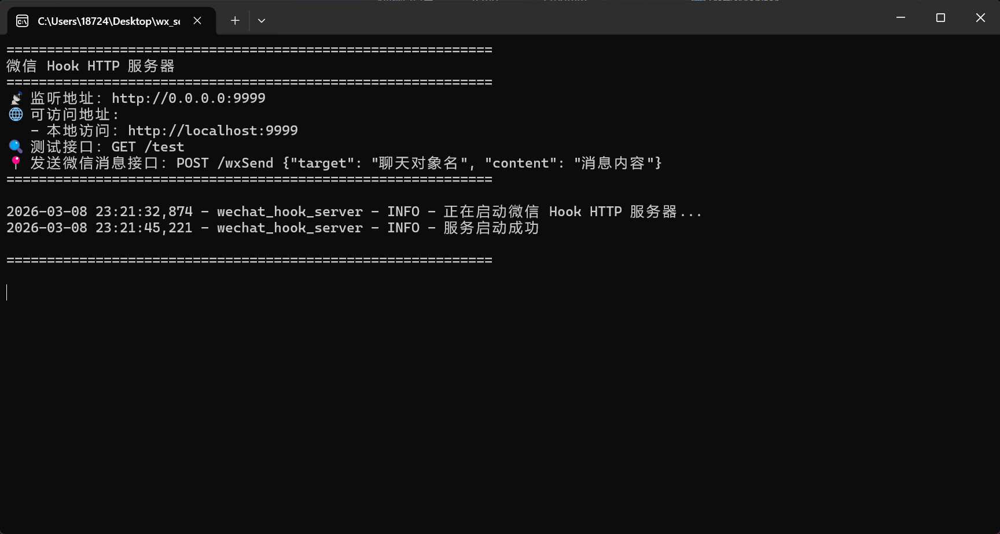

# WechatRobot - 微信消息自动化Hook工具

> 🤖 支持命令行和 HTTP API 两种方式发送微信消息

> 📖 风险提示：
> 本项目采用的windows平台的默认的快捷键，
> 以及微信官方平台默认的快捷键来实现的，不涉及鼠标的模拟操作，也不会入侵微信程序，所以理论上是对账号安全的。如果封号了请自行承担后果。

> ⚠️️️免责声明：本项目仅用于学习和研究目的，任何商业用途均需谨慎考虑。但请务必注意，任何自动化工具都可能存在风险，请勿用于非法用途。


## ✨ 特性

- 🌐 **RESTful API** - 简单的 HTTP 接口
- 🔧 **跨语言支持** - Python/JS/Java/cURL等
- ✅ **错误处理** - 完善的参数验证
- 📦 **开箱即用** - 无需额外配置

## 🎯 使用场景

- 📊 自动化报告推送
- ⏰ 定时提醒通知
- 🤖 聊天机器人集成
- 📱 远程消息发送
- 🔗 与其他系统集成

## 🚀 两种方式

### 方式一：HTTP API（推荐）⭐

**快速启动：**
```bash
uv run start_server.py
```

**或下发行版直接运行exe的服务：**
- [Gitee下载地址](https://gitee.com/jankinliu/WechatRobot/releases/)
- [GitHub下载地址](https://github.com/jankenliu/WechatRobot/releases/)

**启动程序图片演示**


**发送消息：**
```bash
curl -X POST http://localhost:9999/wxSend \
  -H "Content-Type: application/json" \
  -d '{"target":"文件传输助手","content":"你好"}'
```

**自定义端口启动：**
```bash
# 自定义端口
uv run start_server.py 8080
```
---

### 方式二：命令行方式

```shell
# 测试个人微信进程及窗口状态
uv run wechat_sender_v3.py test

# 调试个人微信进程及窗口信息
uv run wechat_sender_v3.py debug

# 发送微信群消息 (需要先微信界面中 ctrl+f 手动输入 [聊天对象名] 进行搜索缓存)
uv run wechat_sender_v3.py send [聊天对象名] [聊天文本内容]
```

**示例：**
```shell
# 发送消息到"文件传输助手"
uv run wechat_sender_v3.py send 文件传输助手 你好，这是一条测试消息

# 发送消息到指定的群聊
uv run wechat_sender_v3.py send 张三 今天天气真好
```

📖 **更多说明：** 见下方详细说明

---

## 📝 API 接口说明

### 1. 发送消息接口

**示例：**
```bash
curl -X POST http://localhost:9999/wxSend \
  -H "Content-Type: application/json" \
  -d '{"target":"文件传输助手","content":"你好"}'
```

---

### 2. 测试微信状态接口

**示例：**
```bash
curl http://localhost:9999/test
```

**响应：**
```json
{
  "service": "WeChat Test API",
  "version": "1.0.0",
  "overall_status": "success",
  "tests": [
    {
      "name": "微信进程查找",
      "status": "success",
      "message": "✅ 个人微信进程查找成功",
      "pid": 12345
    },
    {
      "name": "微信窗口查找",
      "status": "success",
      "message": "✅ 个人微信窗口查找成功",
      "window_hwnd": 65536,
      "window_title": "微信"
    },
    {
      "name": "微信窗口激活",
      "status": "success",
      "message": "✅ 窗口激活成功"
    }
  ]
}
```

**测试项说明：**
- **微信进程查找** - 验证微信进程是否正常运行
- **微信窗口查找** - 验证能否找到微信窗口句柄
- **微信窗口激活** - 验证能否激活微信窗口到前台

---

## 📝 实现原理
1. 激活微信聊天窗口
2. Ctrl+F 触发搜索操作，并将光标定位到搜索框
3. 将待发送的文本存进剪贴板，Ctrl+A 全选搜索框内容，Ctrl+V 粘贴 [聊天对象名]
4. Enter 回车选择第一个聊天对象
5. 激活微信聊天窗口
6. 将待发送的文本存进剪贴板，Ctrl+A 全选输入框内容，Ctrl+V 粘贴 [待发送内容]
7. Enter 回车发送消息

# ⚠️注意事项
- 确保微信已登录且处于正常运行状态
- 聊天对象名称必须与微信中的名称完全匹配
- 如果存在多个同名聊天对象，会选择第一个匹配的结果。
- <span style="color: red; font-weight: bold;">请务必首先手动的 ctrl+f 输入每一个需要自动化的完整的 [聊天对象名] 先将搜索进行缓存，以便于程序执行 ctrl+f 搜索 [聊天对象名] 时，搜索结果第一个就是目标聊天对象</span>
- 发送消息时请确保微信窗口未被最小化，不要人为去操作电脑，否则会影响消息发送


## 📁 项目结构

```
WechatRobot/
├── start_server.py          # 快速启动脚本 ⭐
├── wechat_hook_server.py    # HTTP 服务器
├── wechat_sender_v3.py      # 命令行版本
├── message_sender_interface.py  # 接口定义
├── test.http                # HTTP 请求测试文件
└── Readme.md                # 主文档
```

# 🤝特别鸣谢
- [wxbot-automation](https://github.com/jxyk2007/wxbot-automation) - 微信自动化工具，感谢作者提供的思想
- [Python](https://www.python.org/) - 跨平台的 Python 解释器
- [uv](https://github.com/astral-sh/uv) - 高性能的Python项目管理器
- [pyautogui](https://github.com/asweigart/pyautogui) - 跨平台的 GUI 自动化库
- [pywin32](https://github.com/mhammond/pywin32) - Windows API 访问库
- [psutil](https://github.com/giampaolo/psutil) - 系统进程管理库
